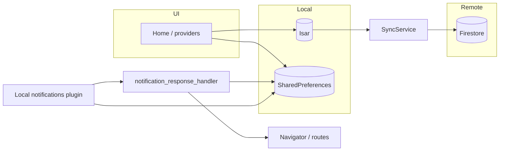

# Isar local-first data flow and notification routing (engineering notes)

This document explains **what we changed**, **how it works**, and **what broke along the way** during the move to a local-first Isar layer and the hardening of **notification tap → Focus** navigation. It is meant for future debugging and onboarding.

---

## 1. Goals

### 1.1 Local-first with Isar

- **Before:** Many reads went to Firestore first, so the UI waited on the network.
- **After:** **Isar** is the primary store for planning-related data (tasks, routines/blocks, reminders, goals). The UI reads from Isar (including streams). **Firestore** remains the remote source: background pull/push via `SyncService` and repository upserts that enqueue remote work.

### 1.2 Notification tap → Focus

- **Before:** Tapping a task reminder sometimes only brought the app forward, without opening Focus with the right task or auto-starting the timer.
- **After:** Taps resolve a **task id**, navigation is **queued** if the navigator is not ready yet, and **cold start** paths drain the plugin’s launch response early. On iOS, the **notification center delegate** is set so the system can deliver tap callbacks to the stack that includes `flutter_local_notifications`.

---

## 2. Architecture overview

- **Writes:** Prefer “write Isar → enqueue sync” patterns in the Isar-backed repositories (see `lib/features/*/data/isar_*_repository.dart`).
- **First launch:** `FirstLaunchGate` runs a one-time `SyncService.instance.syncFromRemote(force: true)` when `isar_seeded_v1` is not set in `SharedPreferences`, then shows the app. On failure it still shows the UI and retries seeding in the background.
- **Notification index:** `LocalNotificationsService` stores `notificationId → taskId` under the key `notification_task_id_index_v1` whenever notifications are scheduled or cancelled, so a tap can resolve the task even when the payload alone is insufficient.

---

## 3. What we fixed (by area)

### 3.1 Isar and sync

| Area | Change |
|------|--------|
| Schemas / collections | Isar models live under `lib/core/local_db/isar_collections/` (tasks, blocks, routines, reminders, goals). |
| Merge / conflict handling | `lib/core/sync/isar_lww_merge.dart`, `lww_updated_at.dart`, `remote_isar_merge.dart` implement last-writer-wins style merges when pulling from Firestore. |
| Offline queue | `SyncService` extended with test hooks such as `debugSkipQueuePersistenceForTests` so VM tests do not need `path_provider` for the on-disk queue. |
| Providers | Planning/reminders/goals providers watch Isar-backed streams instead of blocking on Firestore for the main today/tasks flows. |
| `FirstLaunchGate` | Wraps the app in `main.dart` so the first cold start can seed Isar from remote before showing the main navigator (see `lib/app/first_launch_gate.dart`). |

### 3.2 Notification response handling

| Problem | Fix |
|---------|-----|
| Navigator not mounted when the tap fires | Serialize a **pending route intent** to `SharedPreferences` (`pending_notification_intent_v1`) and call `flushPendingNotificationNavigationIntent()` when the app has a valid context (lifecycle resume, post-frame after bootstrap, after `FirstLaunchGate` marks ready). |
| Cold start: launch response lost or handled too late | `AppBootstrap` initializes the notifications plugin and **drains** the launch notification response early; `LocalNotificationsService` deduplicates drain handling. |
| Unknown `taskId` from `notificationResponse.id` alone | **Persisted map** `notification_task_id_index_v1` maintained on schedule/cancel; handler falls back to legacy scans only if needed. |
| Focus entry arguments | Task taps push `FocusSelectionScreen` with `FocusLaunchArgs` (`autoOpenTimer: true`, `autoStartDelaySeconds: 10`). |

Implementation entry points:

- `lib/app/notification_response_handler.dart` — intent queue, flush, payload parsing.
- `lib/core/notifications/local_notifications_service.dart` — schedule/cancel, id map, drain.
- `lib/core/bootstrap/app_bootstrap.dart` — early plugin init + drain.
- `lib/app/app_lifecycle_task_refresh.dart` — flush on resume.
- `lib/app/first_launch_gate.dart` — flush after seed gate opens (taps during the spinner are not dropped).

### 3.3 iOS and Android platform notes

- **iOS (`ios/Runner/AppDelegate.swift`):** `UNUserNotificationCenter.current().delegate = self` in `didFinishLaunchingWithOptions` so user interactions with notifications are routed; delegate methods forward to `super` so Flutter’s `FlutterAppDelegate` still runs plugin logic. Native `NSLog` lines prefixed with `[NotifTap][iOS]` were added temporarily to compare with Dart `[NotifTap]` logs when diagnosing tap delivery.
- **Android:** Removed `android:taskAffinity=""` from the manifest (empty affinity can interact badly with deep links and activity reuse). `MainActivity` logs `onNewIntent` for debugging.

### 3.4 Tests and Firestore paths in VM tests

- **`FirestorePaths`:** If `Firebase.apps.isEmpty`, `_activeUid` uses `AppConfig.localUserId` so path strings stay consistent in unit tests without initializing Firebase (`lib/core/firebase/firestore_paths.dart`).
- **Tests:** `test/support/isar_test_harness.dart` and repository tests initialize Isar where needed; several tests set `SyncService.debugSkipQueuePersistenceForTests = true` around operations that would otherwise touch the real queue persistence layer.

---

## 4. Errors and symptoms we hit (how to recognize them)

These are also recorded in short form in `documentation/errors.md` (entries 11+).

| Symptom / error | Likely cause | Direction to fix |
|-----------------|--------------|------------------|
| `IsarError: At least one collection needs to be opened` | Opening Isar with no schemas / wrong timing. | Ensure `OfflineStore` (or equivalent) opens with the full schema list; do not call `Isar.open([])`. |
| `No Firebase App '[DEFAULT]'` in tests | Firestore or `FirebaseAuth` used without init. | Use `FirestorePaths` / fakes / mocks; avoid default Firebase in pure VM tests, or initialize test Firebase if integration testing. |
| Logs show id-map updates but **never** `[NotifTap] received response` in Dart | iOS not delivering to the plugin callback chain, or tap not wired through `flutter_local_notifications`. | Confirm `[NotifTap][iOS]` in Xcode console; verify `DarwinInitializationSettings`, categories, and delegate on `UNUserNotificationCenter`. |
| `drainLaunch: no launch notification response` every time | Normal when the app was not opened from a notification; not an error by itself. | Correlate with an actual cold-start-from-notification repro. |
| `flutter test` hangs or fails on Isar native download / HTTP | `TestWidgetsFlutterBinding` blocks real HTTP by default. | Use harness that allows download once, or pre-install Isar core for CI; see Isar docs for headless testing. |
| Test failures writing sync queue to disk | `path_provider` / sandbox in VM tests. | Set `SyncService.debugSkipQueuePersistenceForTests` in `setUp`/`tearDown` in tests that do not need durable queue behavior. |

---

## 5. Debugging checklist (notification → Focus)

1. **Confirm scheduling:** Notification shows at the expected time; payload or id is present.
2. **Dart path:** Search logs for `[NotifTap]` from `notification_response_handler` / `local_notifications_service`.
3. **iOS native path:** Xcode console for `[NotifTap][iOS]` in `AppDelegate`.
4. **Persistence:** After tap with app killed, verify pending intent in prefs (debug only) or that Focus opens after splash/`FirstLaunchGate`.
5. **Task resolution:** If the wrong task opens, verify `notification_task_id_index_v1` is updated when that notification id is scheduled.

---

## 6. Versioning and commits

Release **1.0.1+2** (`pubspec.yaml`) groups this work for store/build metadata. Git history was split into logical commits, for example:

- `feat(local-db): …` — Isar repositories, sync, providers, `FirstLaunchGate`, dependencies.
- `feat(notifications): …` — handler, local notifications service, bootstrap drain, `FirestorePaths` test guard.
- `fix(platform): …` — iOS delegate, Android manifest / activity logging.
- `test: …` — new and updated tests.
- `chore(release): …` — version bump and ignoring repo-root `libisar.dylib`.

---

## 7. Related files (quick index)

| Topic | Path |
|-------|------|
| First launch seed + flush | `lib/app/first_launch_gate.dart` |
| Tap routing + pending intent | `lib/app/notification_response_handler.dart` |
| Lifecycle flush | `lib/app/app_lifecycle_task_refresh.dart` |
| Bootstrap + drain | `lib/core/bootstrap/app_bootstrap.dart` |
| Id map + scheduling | `lib/core/notifications/local_notifications_service.dart` |
| Firestore path helper | `lib/core/firebase/firestore_paths.dart` |
| Sync queue + test flags | `lib/core/sync/sync_service.dart` |
| Handler tests | `test/app/notification_response_handler_test.dart` |
| Isar test harness | `test/support/isar_test_harness.dart` |

---

## 8. Follow-ups (optional cleanup)

- Reduce or gate **`debugPrint` / `print` / `NSLog`** behind `kDebugMode` or a single `debugNotificationRouting` flag once iOS tap delivery is verified on devices.
- Consider a short **CHANGELOG.md** entry for 1.0.1 if you adopt a user-facing changelog later.
