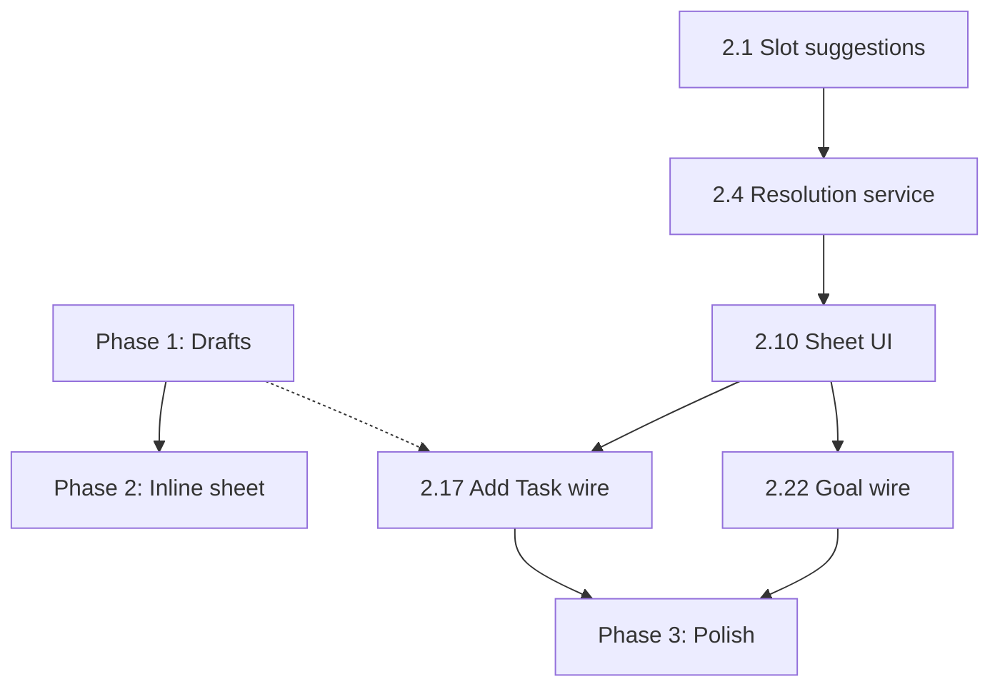

# Task list: Inline conflict resolution & form draft persistence

Generated from [`prd-inline-conflict-resolution-and-form-drafts.md`](prd-inline-conflict-resolution-and-form-drafts.md).

**Implementation order:** Phase 1 → Phase 2 → Phase 3. Phase 1 is independently shippable and fixes “start from zero” even before inline UI exists.

---

## Relevant Files

### Phase 1 — Drafts
- `lib/features/planning/domain/models/add_task_form_draft.dart` — Serializable snapshot for Add Task.
- `lib/features/goals/domain/models/goal_editor_form_draft.dart` — Serializable snapshot for Goal editor (incl. action rows).
- `lib/features/planning/data/form_draft_repository.dart` — Save/load/clear with TTL.
- `lib/core/local_db/isar_collections/isar_form_draft.dart` — Optional Isar backing (or `shared_preferences` adapter).
- `lib/features/planning/application/form_draft_providers.dart` — Riverpod providers + constants (`kFormDraftTtlMinutes = 60`).
- `lib/features/add_task/presentation/add_task_screen.dart` — Restore prompt, debounced save, clear on success.
- `lib/features/goals/presentation/goal_editor_screen.dart` — Same draft wiring.
- `test/features/planning/form_draft_repository_test.dart` — TTL, round-trip, key isolation.

### Phase 2 — Inline conflict
- `lib/features/time_blocks/application/scheduling_slot_suggestions.dart` — Pure slot finder (§6 in PRD).
- `lib/features/time_blocks/application/conflict_resolution_service.dart` — Apply move to other task/goal + re-check wrapper.
- `lib/features/time_blocks/domain/models/conflict_resolution_outcome.dart` — Result type for save flow.
- `lib/features/time_blocks/presentation/scheduling_conflict_sheet.dart` — New UI (replaces moderate/severe use of `ConflictBottomSheet`).
- `lib/features/time_blocks/presentation/conflict_move_panel.dart` — Expandable “move existing” panel.
- `lib/features/time_blocks/application/conflict_entity_title_resolver.dart` — Extend if needed for load-by-id.
- `lib/features/add_task/presentation/add_task_screen.dart` — Wire new sheet + callbacks.
- `lib/features/goals/presentation/goal_editor_screen.dart` — Wire new sheet + callbacks.
- `lib/features/time_blocks/presentation/conflict_bottom_sheet.dart` — Keep for reference or deprecate moderate/severe path only.
- `test/features/time_blocks/scheduling_slot_suggestions_test.dart`
- `test/features/time_blocks/conflict_resolution_service_test.dart`
- `test/features/time_blocks/scheduling_conflict_sheet_test.dart` — Widget test with mocked service.

### Phase 3 — Polish
- `lib/features/analytics/domain/models/analytics_event.dart` — New event types if missing.
- `lib/features/time_blocks/presentation/scheduling_conflict_sheet.dart` — Multi-conflict picker, confirmation chips.

### Notes
- Run `flutter analyze` and `flutter test` after each group.
- Do **not** change `ConflictDetectionEngine` scoring logic in this epic.
- After moving another entity, call `invalidateTaskListProviders` / `invalidateGoals` as today.

---

## Phase overview

| Phase | Goal | Est. | Ships value |
|-------|------|------|-------------|
| **1** | Draft persistence (60 min TTL) | 1–2 days | No more lost form fields |
| **2** | Inline “Move X / Move Y / Allow overlap” | 3–5 days | No navigation to fix other item |
| **3** | Smarter slots, analytics, multi-conflict | 2–3 days | Feels “smart” |

---

## Tasks

### Phase 1 — Form draft persistence

- [ ] **1.0 Draft model & storage**
  - [ ] **1.1** Add `kFormDraftTtlMinutes = 60` and draft key helpers: `add_task_create`, `add_task_edit:{taskId}`, `goal_create`, `goal_edit:{goalId}` in `form_draft_providers.dart`.
  - [ ] **1.2** Define `AddTaskFormDraft` with `toJson`/`fromJson` covering all `AddTaskScreen` controller/toggle fields + `savedAtMs`.
  - [ ] **1.3** Define `GoalEditorFormDraft` with action rows `{id?, title, completed}` + all goal editor fields + `savedAtMs`.
  - [ ] **1.4** Implement `FormDraftRepository`: `save(key, json)`, `load(key)`, `delete(key)`, `isExpired(savedAtMs)` using Isar **or** `SharedPreferences` (pick one; document in code comment).
  - [ ] **1.5** Register Isar schema in `isar_schemas.dart` if using Isar; run code gen.
  - [ ] **1.6** Unit tests: round-trip JSON, TTL expiry, separate keys for create vs edit.

- [ ] **1.7 Add Task integration**
  - [ ] **1.8** Add `_draftKey` getter on `_AddTaskScreenState` (create vs `AddTaskEditArgs.taskId`).
  - [ ] **1.9** `initState`: after load edit (if any), call `_offerDraftRestore()` — if valid draft and not equal to loaded edit, show dialog Restore / Start fresh; on Restore, `_applyDraft`.
  - [ ] **1.10** Implement `_captureDraft()` from current controllers/toggles.
  - [ ] **1.11** Debounce save: `Timer` 10s after any field change while `_dirty == true`.
  - [ ] **1.12** `dispose` + `WidgetsBindingObserver`: persist draft on pause/inactive if dirty.
  - [ ] **1.13** On successful `_onSave`: `delete(draftKey)` before `Navigator.pop`.
  - [ ] **1.14** Manual QA: fill form → back → reopen within 60m → Restore; wait 61m → no restore.

- [ ] **1.15 Goal editor integration**
  - [ ] **1.16** Mirror 1.8–1.14 for `GoalEditorScreen` including `_actionDrafts` list in draft payload.
  - [ ] **1.17** Ensure restore runs after `_seedFromBundle` only when user chooses Restore (avoid double-seed race).

---

### Phase 2 — Inline conflict resolver

- [ ] **2.0 Slot suggestions (pure Dart)**
  - [ ] **2.1** Create `scheduling_slot_suggestions.dart` with `List<TimeSlotSuggestion> suggestAlternativeSlots({ required DateTime planDay, required int durationMinutes, required List<ScheduledTimeBlock> blocksOnDay, required DateTime afterTime, Set<String> ignoreEntityIds })`.
  - [ ] **2.2** Implement gap scan (15m step), max 2 suggestions, labels `Suggested` / `Alternative`.
  - [ ] **2.3** Unit tests: full overlap → suggestion starts at other block end; day boundary; ignore proposed id.

- [ ] **2.4 Conflict resolution service**
  - [ ] **2.5** Create `ConflictResolutionOutcome` enum/class: `proceedToSave`, `stayOnForm`, `proposedStartAdjusted`, `proposedDurationAdjusted`.
  - [ ] **2.6** `ConflictResolutionService.moveExistingTask({ taskId, routineId, blockId, newStart, durationMinutes })` — load task, update `reminderTimeIso`, `upsertTask`, `TimeBlockSyncService.syncBlock`, reminder repo.
  - [ ] **2.7** `moveExistingGoal({ goalId, newStartMinutesFromMidnight })` — load goal, update reminder fields, `upsertGoal`, `GoalBlockSyncService.syncBlockForGoal`.
  - [ ] **2.8** `recheckProposedBlock(ScheduledTimeBlock proposed, Map titles)` — wraps `TimeBlockSyncService.checkConflicts`.
  - [ ] **2.9** Unit tests with fake `PlanningRepository` / mock repos for move paths.

- [ ] **2.10 Scheduling conflict sheet UI**
  - [ ] **2.11** Define `SchedulingConflictSheet.show(...)` API: `proposedTitle`, `proposedKind`, `conflicts`, `proposedBlock`, `onMoveProposed(void Function(DateTime start, int duration))`, `onComplete(ConflictResolutionOutcome)`.
  - [ ] **2.12** Build header: overlap summary (reuse copy from `ConflictBottomSheet._overlapSummary`).
  - [ ] **2.13** Three primary buttons: Move [other title], Move [proposed title], Allow overlap.
  - [ ] **2.14** `ConflictMovePanel`: current window text; two suggestion chips; Custom time → `showTimePicker`; Apply calls service move + `recheck`; show ✓ confirmation.
  - [ ] **2.15** When user picks “Move proposed”, pop sheet with `stayOnForm` + snackbar “Adjust time below”; parent scrolls to schedule section.
  - [ ] **2.16** “Continue” enabled when `recheck` returns no moderate/severe conflicts (minor still auto-ok per existing rules).

- [ ] **2.17 Wire Add Task save flow**
  - [ ] **2.18** Refactor `_checkTimeBlockConflicts` to call `SchedulingConflictSheet` instead of `ConflictBottomSheet` for moderate/severe.
  - [ ] **2.19** Pass lambdas to update `_reminderTime` / `_duration` when proposed move chosen.
  - [ ] **2.20** On `proceedToSave` / allow overlap: return true; log `overlapOverridden` as today.
  - [ ] **2.21** Do **not** pop `AddTaskScreen` on cancel — user stays on form with fields intact (+ draft from Phase 1).

- [ ] **2.22 Wire Goal editor save flow**
  - [ ] **2.23** Refactor `_checkGoalTimeBlockConflicts` to use same sheet; map goal duration to `kGoalBlockDefaultDurationMinutes`.
  - [ ] **2.24** Custom time for goal adjusts `_reminderMinutesFromMidnight` only.

- [ ] **2.25 Regression QA**
  - [ ] **2.26** Task vs task, task vs goal, goal vs goal overlap scenarios (per `prd-time-block-cross-entity-conflicts.md`).
  - [ ] **2.27** Verify minor conflict still uses SnackBar-only path (no sheet).

---

### Phase 3 — Polish & intelligence

- [ ] **3.0 Smarter suggestions**
  - [ ] **3.1** Load blocks for **plan day** via repository (not only “today”) when Add Task reminder date ≠ today.
  - [ ] **3.2** Prefer gap **before** proposed start if user chose “Move proposed” and backward gap exists.
  - [ ] **3.3** Round suggestion times to 5-minute boundaries for display.

- [ ] **3.4 Multi-conflict**
  - [ ] **3.4** If `conflicts.length > 1`, show list; user picks which entity to resolve first; after resolve, re-run check until single or zero severe overlaps.
  - [ ] **3.5** Show “+N more” collapsed with expand.

- [ ] **3.6 Analytics & tests**
  - [ ] **3.7** Fire `overlap_resolved_inline` with `entityKind`, `movedEntity` (proposed|existing), `suggestionIndex` (0|1|custom).
  - [ ] **3.8** Fire `form_draft_restored` / `form_draft_discarded` from Phase 1 dialogs.
  - [ ] **3.9** Widget test: pump sheet → Apply suggestion → mock service called → Continue enabled.

- [ ] **3.10 Documentation**
  - [ ] **3.11** Update `tasks/prd-time-block-cross-entity-conflicts.md` cross-link or add “Superseded for UX by inline resolver” note on bottom sheet section.
  - [ ] **3.12** Add manual QA checklist to `tasks/manual-qa-v2.md` (create task → conflict → inline move other → save without re-entry).

---

## Dependency graph (implementation)

---

## Suggested sprint breakdown

| Sprint | Deliverable |
|--------|-------------|
| Sprint A | Complete **1.0–1.17** (drafts shipped) |
| Sprint B | **2.0–2.10** slot + service + sheet UI |
| Sprint C | **2.17–2.27** wiring + QA |
| Sprint D | **3.0–3.12** polish |

---

## Acceptance criteria (epic done)

- [ ] User creates Workout overlapping Morning Routine; moves Morning Routine inline; Workout fields unchanged; both save correctly.
- [ ] User leaves Add Task mid-entry; returns within 60 minutes; Restore repopulates all fields.
- [ ] User chooses Start fresh; old draft deleted.
- [ ] Allow overlap still works; analytics fire.
- [ ] `flutter test` green for new unit/widget tests.
